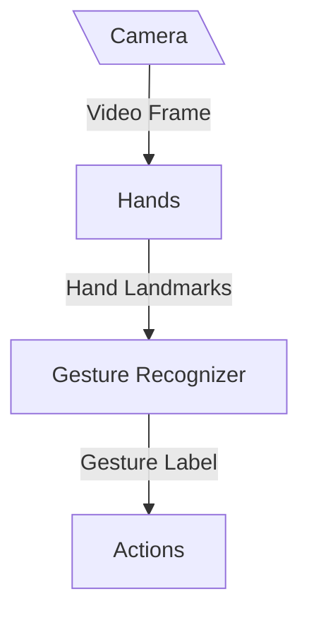

# JesturePipe Graph

The JesturePipe graph implements the pipeline for Jesture. In summary, the pipeline transforms the video frames from the camera into actions. 

The structure of the graph is as follows:

